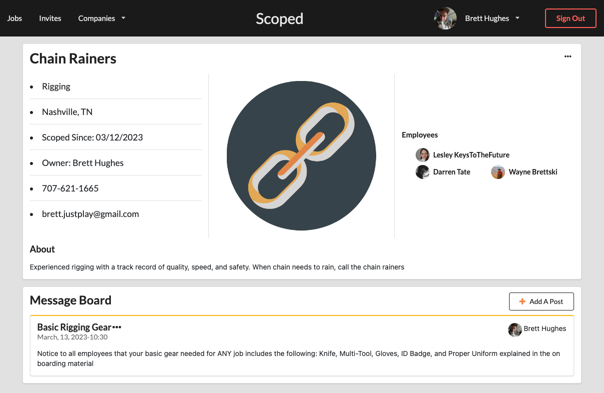
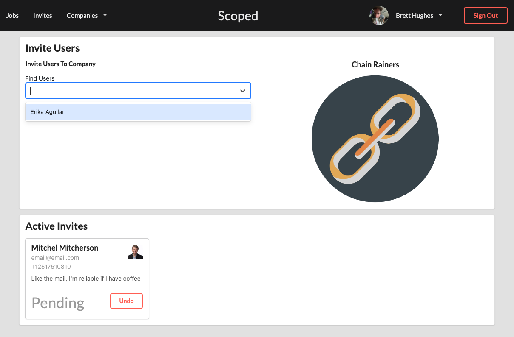
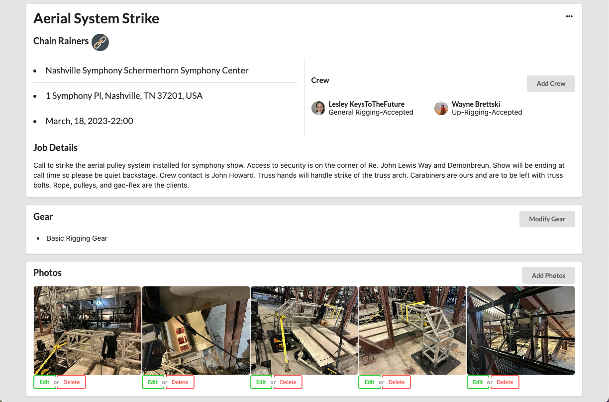
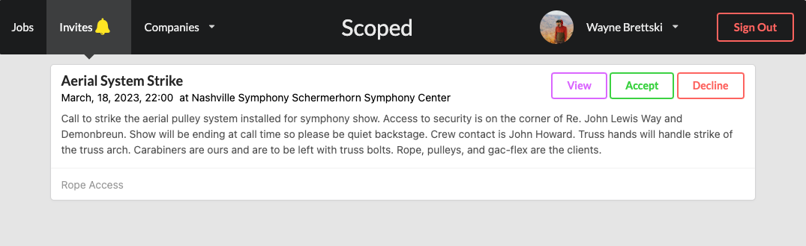
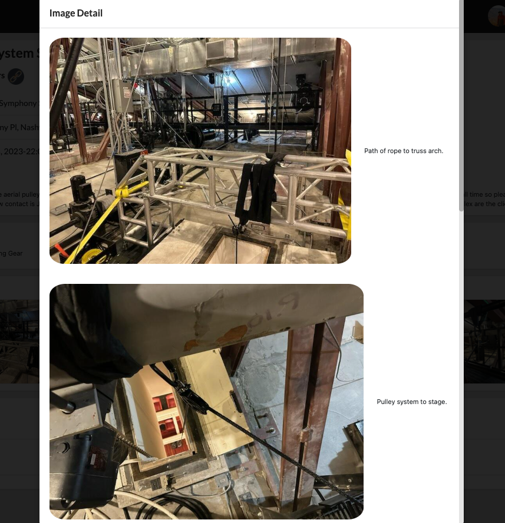
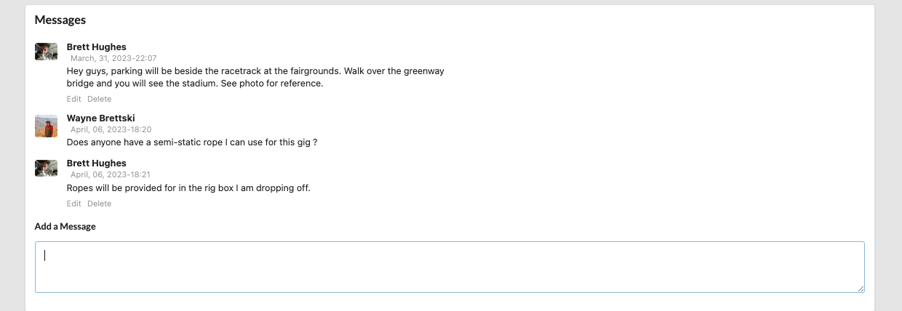

# Welcome to Scoped-Server

Scoped is a Scope of Work application that aims to provide transparency and clear communication from client to skilled laborer.  Inspiration was brought on by past experiences where missing details led to waste of time and money.

## Tech Stack

- React.js with Next.js Framework.
- Python with Django Framework.
- Semantic UI Component Library
- AWS S3 Bucket for Photo Storage
- Google Maps API for City and Establishment Searching

## Features

- **Users can create a company**



- **Users can be invited to join a company**



- **Users can create a jobs and invite employees to accept the work**



- **Employees can accept or decline the company and job invites**



- **Images prvide detail to job descriptions**



- **Comments on the jobs allow discussion to clear up questions**



## Usage
<h3>Runing the project locally</h3>
- Clone this repository to you machine
- Create a .env file in the root of the repository and copy the code below
- <h4>Installations</h4>
- Run `pipenv install`
- Run `pipenv shell`
- Run `pip install django-phonenumber-field`
- Run `pip install django phonenumbers`
- Run `pip install googlemaps`
```
GOOGLE_API_KEY = '<YOUR GOOGLE MAPS API KEY>'
DEBUG = True
```
- Run the command `echo "SECRET_KEY=$(python -c 'from django.core.management.utils import get_random_secret_key; print(get_random_secret_key())')" >> .env
` and check that SECRET_KEY is now present in the .env file

<h3>Third Party Setup</h3>
<h4>Google Maps API</h4>
- Set up a Google Maps Platform Project to obtain an API KEY [HERE](https://mapsplatform.google.com/?utm_source=search&utm_medium=googleads&utm_campaign=brand_core_exa_desk_mobile_us&gclid=Cj0KCQjw_r6hBhDdARIsAMIDhV8lHRlLjK7DaVksC2RGodc-NVyN-Z3s8nDHdgkufo31s1qccZzRStsaAuBYEALw_wcB&gclsrc=aw.ds). Places API must be enabled.
- Under 'Credentials' locate your API KEY and copy it into the .env file

<h4>AWS S3 Bucket</h4>
- Create a AWS account (if needed) and set up a AWS S3 bucket [HERE](https://aws.amazon.com/s3/)
- Download and save the CSV file containing your API KEY and API SECRET
- Disable "Block all public access"
- Create a bucket policy to match the following with your new bucket
```
{
    "Version": "2012-10-17",
    "Statement": [
        {
            "Sid": "AllowPublicRead",
            "Effect": "Allow",
            "Principal": "*",
            "Action": "s3:GetObject",
            "Resource": "<YOUR BUCKET ARN HERE>"
        }
    ]
}
```
- Run `pip install boto3` from the terminal
- Run `aws configure set aws_access_key_id <YOUR_ACCESS_KEY>`from the saved CSV file
- Run `aws configure set aws_secret_access_key <YOUR_SECRET_KEY>` from the saved CSV file


